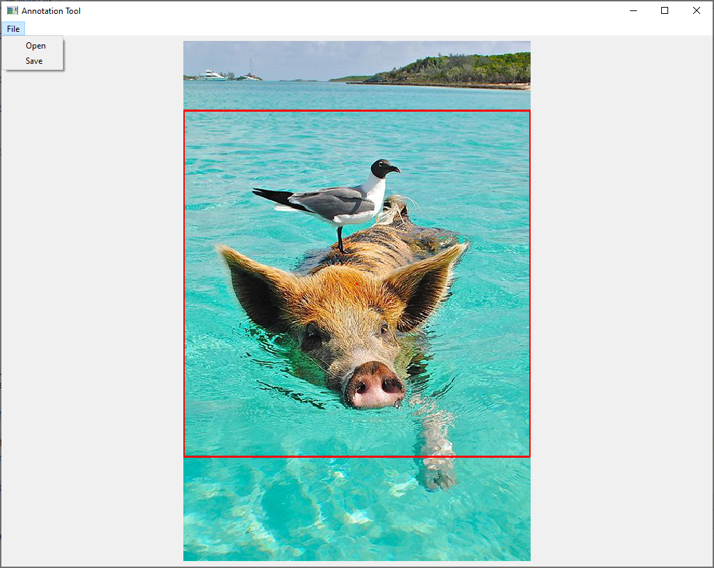

# WeDreamOfNature
## Overview
### reddit_scrapper.py
A script for scrapping reddit posts using the Pushshift API.
### annot_tool.py

A little tool to go over a scrapped dataset, flag unsuited images and adjust the crop mask used to create StyleGAN training images.
