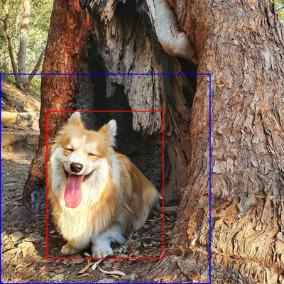
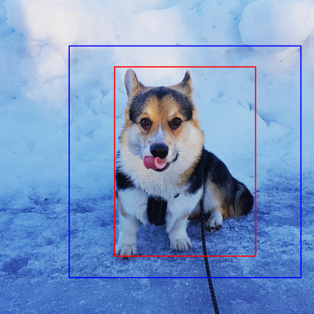
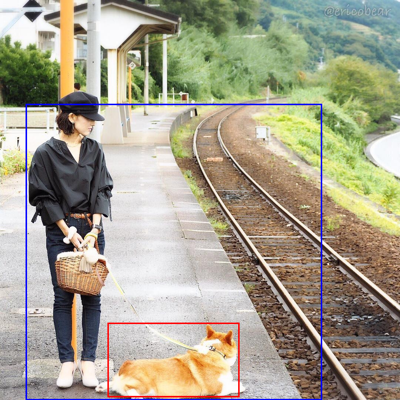
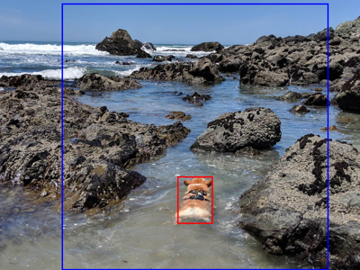

# Did Somebody Say Corgi?

A 1024x1024 [StyleGAN2-ADA](https://github.com/NVlabs/stylegan2-ada) model trained on corgi images found on Instagram.

https://user-images.githubusercontent.com/45483347/111032204-588bdd80-840b-11eb-8e4c-5a780a7f072e.mp4

**This repository features:**

- A [high-quality dataset](https://drive.google.com/file/d/1WDLf-fhamq0gl3RsAdx4twDyilpW-Mq9/view?usp=sharing) of ~130k corgi images
- [Model checkpoints](https://drive.google.com/drive/folders/1-7FqNaBC7RNDxWh9-QYedD5NK9LX7KA7?usp=sharing) of the trained StyleGAN2 model
- Colab notebook to play around with 

## Project Outline

In the following I will give a rough overview about what I did in this project for everyone interested.

### Dataset Creation

After I made the decision that it would be a great project to train a StyleGAN2 model on images of corgis (I can't exactly remember why though haha) I first searched the internet for a preexisting high-resolution corgi image dataset. Suprisingly (not really) I wasn't able to find any, so I had to create my own dataset. After some experiments I decided that I could probably get more then enough corgi images of Instagram. I started with scrapping 350000 corgi images from instagram.

Because StyleGAN2 usually requires uniform and clean data to achieve good results I then performed some heuristic-based preprocessing on the initial dataset. My filtering criteria were:

- Only one corgi per image
  - For this a [YOLOv3](https://github.com/ultralytics/yolov3) was trained on the [Stanford Dogs Dataset](http://vision.stanford.edu/aditya86/ImageNetDogs/) and used to predict dog bounding boxes on all of the images
- Should be as centered around the corgi as possible
  - Filtered by looking at center shift between corgi detection bounding box and square crop window
- Should fill out a minimum percentage of the image (i.e. should not be too small)
  - In order to artificially increase overlap it was allowed to crop corgis with a crop window as small as 800x800 and upsample the crop to 1024x1024 
- No duplicates (using [imgdupes](https://github.com/knjcode/imgdupes))

This reduced the dataset to 136255 high quality corgi images. For more details have a look at the [dataset notebook](dataset.ipynb).

**Good samples**

**Bad samples**

### Model Training

The rest was easy. I first experimented with training the model on TPUs provided by the [Tensorflow Research Cloud (TFRC)](https://www.tensorflow.org/tfrc) which in my case just didn't work because training time was much too long. A little bit frustraded I got myself a Colab Pro subscription, where the StyleGAN2 model was trained for 18 days on a Tesla V100. Have a look at the [train/test notebook](train_test.ipynb) for more details.
