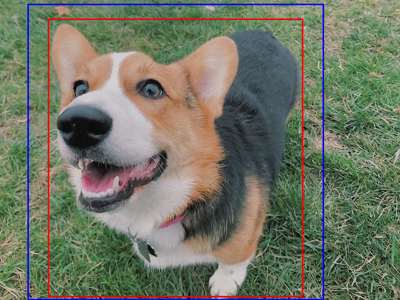
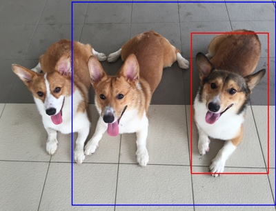

# Did Somebody Say Corgi?

A 1024x1024 [StyleGAN2-ADA](https://github.com/NVlabs/stylegan2-ada) model trained on corgi images found on Instagram.

**Training Results**

**This repository features:**

- A [high-quality dataset](https://drive.google.com/file/d/1WDLf-fhamq0gl3RsAdx4twDyilpW-Mq9/view?usp=sharing) of ~130k corgi images
- [Model checkpoints](https://drive.google.com/drive/folders/1-7FqNaBC7RNDxWh9-QYedD5NK9LX7KA7?usp=sharing) of the trained StyleGAN2-ADA model
- Colab notebook to play around with 

## Project Outline

In the following I will give a rough overview about what I did in this project for everyone interested.

### Dataset Creation

After I made the decision that it would be a great project to train a StyleGAN2 model on images of corgis (I can't exactly remember why though haha) I first searched the internet for a preexisting high-resolution corgi image dataset. Suprisingly (not really) I wasn't able to find any, so I had to create my own dataset. After some experiments I decided that I could probably get more than enough corgi images of Instagram. I started with scrapping 350000 corgi images as an initial data base.

Because StyleGAN2 usually requires uniform and clean data to achieve good results I then performed some heuristic-based preprocessing on the initial dataset. My filtering criteria were:

- Only one corgi per image
  - For this a [YOLOv3](https://github.com/ultralytics/yolov3) was trained on the [Stanford Dogs Dataset](http://vision.stanford.edu/aditya86/ImageNetDogs/) and used to predict dog bounding boxes on all of the images
- Should be as centered around the corgi as possible
  - Filtered by looking at center shift between corgi detection bounding box and square crop window
- Should fill out a minimum percentage of the image (i.e. should not be too small)
  - In order to artificially increase overlap I allowed the cropping algorithm to use a crop window as small as 800x800 and upsample the crop to 1024x1024 from there.
- No duplicates (using [imgdupes](https://github.com/knjcode/imgdupes))

This reduced the dataset to 136255 high quality corgi images. For more details have a look at the [dataset notebook](dataset.ipynb).

**Good samples**

**Bad samples**

### Model Training

The rest was easy. I first experimented with training the model on TPUs provided by the [Tensorflow Research Cloud (TFRC)](https://www.tensorflow.org/tfrc). In my case this just didn't work (but I'm aware other StyleGAN projects which successfully did this using the same repositories as I did), because training speed was much to slow. That's when I got myself a Google Colab Pro subscription and trained the StyleGAN2 model for 18 days on a Tesla V100. This however does not include a lot of days where something went wrong and nothing progressed. Overall I was occupied with starting Colab runtimes every day for ~1 month. 

Have a look at the [train/test notebook](train_test.ipynb) for more details. You can also use this notebook to train your own model! 

## Future Work

The initial plan was to further explore the trained model, e.g. search for meaningful latent space directions and other StyleGAN related methods proposed in recent literature. If anybody comes about to this I'd be happy to hear from you. I imagine the corgi latent space to have some funny characteristics.
